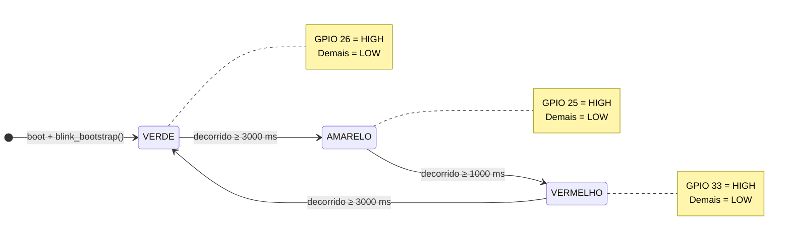

# Processo Seletivo – Intensivo Maker | IoT

<details>
<summary><strong> SETUP da Etapa Prática – Sistemas Embarcados PROPOSTA pelo PNAAT(DropDown ⬇)</strong></summary>
<br>

 Bem-vindo(a) à **etapa prática do processo seletivo para o Intensivo Maker | IoT**.
Esta atividade tem como objetivo avaliar suas competências em **Sistemas Embarcados**, com foco em **organização de projeto, lógica de firmware e simulação de hardware**, a partir da aplicação prática dos conhecimentos adquiridos nos cursos EAD da etapa anterior.

> 🎯 **Objetivo principal**  
> Avaliar sua capacidade de **planejar, estruturar e desenvolver** uma solução funcional de sistemas embarcados, seguindo boas práticas de engenharia.

---

<details>
<summary><strong> ## 🏁 Passo 0 – Antes de Tudo</strong></summary>
<br>

Se você **nunca utilizou Git ou GitHub**, não se preocupe.  
Siga atentamente os passos abaixo — eles fazem parte do processo de aprendizagem esperado.

### 1️⃣ Criação de Conta no GitHub

1. Acesse: https://github.com  
2. Clique em **Sign up**  
3. Crie sua conta gratuita seguindo as instruções da plataforma  

> 📌 O GitHub será utilizado para:
> - Envio do seu projeto  
> - Versionamento do código  
> - Correção e validação automática via GitHub Actions  

---

### 2️⃣ Instalação do Git

O **Git** é a ferramenta responsável pelo controle de versões do seu código.

### Windows
Baixe e instale o **Git Bash**:  
https://git-scm.com/downloads

### Linux / macOS
Verifique se o Git já está instalado:

```bash
git --version
```
> Caso não esteja, instale pelo gerenciador de pacotes do seu sistema.
</details>

<details>
<summary><strong> ## ⚙ Passo 1 – Preparando o Ambiente</strong></summary>
<br>


Para desenvolver o desafio, você deverá criar uma cópia deste repositório no seu GitHub.

### 1️⃣ Fork do Repositório
No canto superior direito desta página, clique em Fork


Uma cópia do repositório será criada no seu perfil do GitHub

> 🔎 O Fork permite que você trabalhe de forma independente, sem alterar o repositório original do processo seletivo.

### 2️⃣ Clone do Repositório

No repositório do seu Fork, clique em **<> Code**


Copie a URL e execute no terminal:

```bash
git clone https://github.com/SEU_USUARIO/nome-do-repositorio.git
cd nome-do-repositorio
```

> O comando git clone cria uma cópia local do repositório para desenvolvimento.

### 3️⃣ Preparação do Ambiente de Execução

Você pode executar o projeto de duas formas. Escolha apenas uma.

#### 🔹 Opção A – Ambiente Python Local

**Requisitos:**

- Python 3.10 ou 3.11
- pip

**Instale as dependências:**

```bash
pip install -r requirements.txt
```

#### 🔹 Opção B – Dev Container (Recomendado)

Este repositório inclui um Dev Container, garantindo um ambiente padronizado.

**Requisitos:**

- VS Code
- Docker instalado
- Extensão Dev Containers

**Passos:**

1. Abra o repositório no VS Code
2. Clique em “Reopen in Container”
3. Aguarde a criação automática do ambiente

> ➡️ Todas as dependências serão instaladas automaticamente.

</details>

<details>
<summary><strong> ## 🔐 Passo 2 – Criando sua API Key do Wokwi</strong></summary>
<br>


A simulação do projeto será executada automaticamente via GitHub Actions, utilizando o Wokwi CLI.

Para isso, você precisa gerar uma API Key.

1. Acesse: https://wokwi.com/dashboard/ci
2. Faça login (Google ou GitHub)
3. Clique em Generate API Token
4. Copie a chave gerada (exemplo: wokwi-xxxxxxxx)

>⚠️ Importante
- Nunca faça commit dessa chave
- Ela deve ser armazenada apenas como secret no GitHub
</details>

<details>
<summary><strong> ## 🔒 Passo 3 – Configurando a API Key no GitHub (Secrets)</strong></summary>
<br>


**No repositório do seu Fork:**

1. Vá em Settings
2. Acesse Secrets and variables → Actions
3. Clique em New repository secret
4. Nome: WOKWI_API_KEY
5. Valor: sua chave gerada
6. Salve

> ✔️ As GitHub Actions do template já estão preparadas para usar essa variável automaticamente.
</details>

<details>
<summary><strong> ## 🧠 Passo 4 – Desafio Técnico</strong></summary>
<br>


Você deverá desenvolver um projeto de sistemas embarcados simulados, utilizando Python e Wokwi.

### 📁 Estrutura mínima esperada

```text
/project
 ├── src/
 │   └── main.py        # Código principal do projeto
 ├── wokwi.toml         # Configuração da simulação
 ├── diagram.json       # Circuito no Wokwi
 └── README.md          # Explicação do seu projeto
```

> Você pode expandir essa estrutura se desejar, desde que mantenha os arquivos essenciais.

### 🛠 Como Desenvolver seu Projeto

O desenvolvimento acontece principalmente nos arquivos abaixo:

#### 1️⃣ src/main.py

- Código Python executado na simulação
- Implementa a lógica do sistema embarcado
- Exemplos: controle de LEDs, leitura de sensores, estados, temporizações, etc.

#### 2️⃣ diagram.json

- Define o hardware virtual do projeto
- Componentes como:
  - LEDs
  - Botões
  - Sensores
  - Placa microcontroladora

#### 3️⃣ wokwi.toml

- Configura a simulação:
  - Tipo de placa
  - Framework
  - Dependências adicionais

#### 4️⃣ Commit e Push

Após suas alterações:

```bash
git add .
git commit -m "Descrição clara do que foi feito"
git push
```
### ⚙ Execução Automática (GitHub Actions)

A cada push, o GitHub Actions irá automaticamente:

- Executar o pipeline de build
- Rodar a simulação via Wokwi CLI
- Validar que o projeto executa sem erros

### 📌 Caso algo falhe:

- Vá até a aba Actions
- Analise os logs da execução
- Corrija e envie novamente

## 📊 Critérios de Avaliação

Esta etapa será avaliada considerando:

- Funcionamento correto da simulação
- Código organizado e legível
- Estrutura de arquivos correta
- Uso adequado do Wokwi
- Commits claros e bem descritos
- Projeto executando sem falhas nas Actions

---

## 📎 Submissão Final

Após concluir o desenvolvimento:

1. Verifique se o projeto **executa sem erros** nas GitHub Actions  
2. Confirme que todos os arquivos obrigatórios estão presentes  
3. Copie o link do **seu repositório no GitHub**

📤 Envie o link conforme as orientações do processo seletivo na plataforma **Moodle**.

> ✅ Este relatório faz parte da avaliação técnica.  
> Clareza, objetividade e organização são tão importantes quanto o funcionamento do código.

## 🆘 Suporte

Em caso de dúvidas:

- Consulte o material dos cursos EAD
- Leia atentamente este README
- Analise os logs das GitHub Actions
- Utilize os canais oficiais para contato com os instrutores

Boa sorte no processo seletivo.
Mostre sua capacidade de pensar como um engenheiro de sistemas embarcados.
****
</details>

---

## 📝 Relatório do Candidato

O arquivo **`README.md` do seu repositório** deve ser utilizado como o  
**relatório final do desafio técnico**.

Preencha todas as seções abaixo de forma **clara, objetiva e técnica**.

> 💡 **Dica importante**  
> Não é necessário um relatório extenso.  
> O principal critério é demonstrar **clareza nas decisões técnicas**, organização e entendimento do sistema embarcado desenvolvido.

---

</details>

## 📑 Sumário
- [👤 Identificação](#-identificação-do-candidato)
- [1️⃣ Visão Geral](#1️⃣-visão-geral-da-solução)
- [2️⃣ Arquitetura](#2️⃣-arquitetura-do-sistema-embarcado)
- [3️⃣ Componentes](#3️⃣-componentes-utilizados-na-simulação)
- [4️⃣ Decisões Técnicas](#4️⃣-decisões-técnicas-relevantes)
- [5️⃣ Versionamento](#5️⃣-estratégia-de-branches-e-versionamento)
- [6️⃣ Resultados](#6️⃣-resultados-obtidos)
- [7️⃣ Melhorias](#7️⃣-limitações-e-melhorias-futuras)
---
 
### 👤 Identificação do Candidato
 
- **Nome completo**  Jhonatan Gonçalves Pereira 
- **GitHub**  https://github.com/jhonatan-goncalves-pereira 
 
---
 
## 1️⃣ Visão Geral da Solução


 
**Objetivo:** Implementar um semáforo de trânsito autônomo e simulado, utilizando ESP32 e três LEDs (verde, amarelo e vermelho), controlados por firmware MicroPython com lógica de temporização não-bloqueante.
 
**O que o sistema faz:**  
O firmware executa um ciclo contínuo de três estados (VERDE → AMARELO → VERMELHO → VERDE…), alternando os LEDs com temporização precisa e sem bloquear o processador. Um Watchdog Timer (WDT) garante que o sistema se recupere automaticamente em caso de travamento.
 
**Interação do usuário:**  
Não há interação direta. O ciclo ocorre de forma autônoma e contínua; as transições de estado são monitoráveis via Serial Monitor e validadas automaticamente pelo GitHub Actions.
 
[⬆️ Voltar ao sumário](#-sumário)
 
---
 
## 2️⃣ Arquitetura do Sistema Embarcado
 
### Padrão: Máquina de Estados Finita (FSM)
 
O firmware adota o padrão **Finite State Machine (FSM)** não-bloqueante como arquitetura central. A escolha prioriza três propriedades de engenharia:
 
| Propriedade | Benefício |
|---|---|
| **Não-bloqueante** | Loop principal termina em ~10 ms, deixando CPU disponível para expansões futuras |
| **Modular** | Cada estado é auto-contido, testável e substituível de forma independente |
| **Escalável** | Novos estados ou transições são adicionados sem refatorar a lógica existente |
 
### Diagrama de Estados (FSM)
 

 
### Fluxo de Dados (Signal Path)
 
```
ESP32 GPIO (3.3 V HIGH)
    │
    ▼
Anodo do LED (A)       ← tensão de entrada: 3.3 V
    │
   LED                 ← queda de tensão: ~2.1 V (Vf)
    │
Catodo do LED (C)      ← tensão residual: ~1.2 V
    │
Resistor 220 Ω         ← limita corrente: I = (3.3 - 2.1) / 220 ≈ 5.5 mA
    │
GND (0 V)              ← referência do circuito
```
 
> O resistor protege o pino GPIO e o LED. Sem ele, a corrente seria limitada apenas pela resistência interna do ESP32 (~50 Ω), resultando em ~60 mA — acima do limite seguro de 12 mA/pino.
 
### Temporização Não-Bloqueante
 
```python
# Comparação de abordagens:
 
# ❌ Bloqueante — impede qualquer processamento paralelo
time.sleep(3)
 
# ✅ Não-bloqueante — CPU livre entre verificações
agora     = time.ticks_ms()
decorrido = time.ticks_diff(agora, ultimo_tick)
if decorrido >= DURACAO_MS[estado_atual]:
    # transição de estado
```
 
`ticks_diff()` trata automaticamente o overflow do contador de 32 bits (que ocorreria após ~49,7 dias de execução contínua), garantindo precisão temporal a longo prazo.
 
### Watchdog Timer (WDT)
 
```python
wdt = WDT(timeout=8000)   # reinicializa ESP32 se loop travar por > 8 s
# ...
while True:
    wdt.feed()             # alimentado a cada ~10 ms em operação normal
```
 
O WDT é a última linha de defesa contra deadlocks em ambiente de produção. O timeout de 8 s foi dimensionado com margem de 2,6× sobre o estado mais longo (VERDE = 3 s).
 
[⬆️ Voltar ao sumário](#-sumário)
 
---
 
## 3️⃣ Componentes Utilizados na Simulação
 
| Componente | ID | Qtd | Pino GPIO | Função |
|---|---|---|---|---|
| ESP32 DevKit C v4 | `esp` | 1 | — | Microcontrolador; executa o firmware MicroPython |
| LED Verde | `led_verde` | 1 | GPIO 26 | Sinalização: passagem liberada |
| LED Amarelo | `led_amarelo` | 1 | GPIO 25 | Sinalização: atenção |
| LED Vermelho | `led_vermelho` | 1 | GPIO 33 | Sinalização: parada obrigatória |
| Resistor 220 Ω | `r1`, `r2`, `r3` | 3 | — | Limitação de corrente (protege GPIO e LED) |
 
**Critério de seleção dos pinos GPIO:**
 
- **GPIO 26** — pino de propósito geral sem conflito com funções de boot ou UART
- **GPIO 25** — DAC1, operado aqui exclusivamente como saída digital
- **GPIO 33** — RTC GPIO, compatível com saída digital; não afeta inicialização
- **GPIO 2**  — LED built-in do DevKit C v4, usado apenas durante o bootstrap
Todos os componentes são definidos e conectados no `diagram.json`, com fios coloridos por função: **verde** (sinal VERDE), **dourado** (sinal AMARELO), **vermelho** (sinal VERMELHO) e **preto** (GND).
 
[⬆️ Voltar ao sumário](#-sumário)
 
---
 
## 4️⃣ Decisões Técnicas Relevantes
 
### ✅ FSM em vez de sequência linear com delays
 
**Problema:** `time.sleep()` bloqueia a CPU durante toda a duração do estado (até 3 s), tornando impossível reagir a eventos externos (botão, sensor, interrupção).  
**Solução:** FSM com `ticks_ms()` + `ticks_diff()` — a CPU é liberada a cada 10 ms.  
**Trade-off:** Código ligeiramente mais complexo, mas pronto para produção e expansão.
 
### ✅ Função auxiliar `apagar_todos()`
 
Centraliza o desligamento atômico dos LEDs antes de cada transição. Elimina a possibilidade de dois LEDs acesos simultaneamente, que em um semáforo real significaria sinal contraditório e risco de segurança.
 
### ✅ Dicionário de despacho (`LEDS: dict`)
 
Em vez de `if estado == VERDE: led_verde.on() elif...`, o dicionário mapeia diretamente `estado → pino`. Resultado: `O(1)` de acesso, código extensível a novos estados sem alterar a lógica de transição.
 
### ✅ Watchdog Timer (WDT)
 
Proteção contra deadlocks em hardware real. Em simulação, demonstra conhecimento de práticas de firmware para produção. Timeout de 8 s com margem 2,6× sobre o estado mais longo (3 s).
 
### ✅ Resistores de 220 Ω
 
Cálculo: `R = (Vcc - Vf) / I = (3,3 V - 2,1 V) / 0,006 A = 200 Ω`. Valor comercial mais próximo acima: **220 Ω**. Protege o pino GPIO (limite de 12 mA) e garante vida útil dos LEDs.
 
### ✅ Saída serial como evidência de teste
 
`print("Teste")` na inicialização é a string capturada pelo argumento `--expect-text` do Wokwi CLI no GitHub Actions. Garante que o CI valida não apenas a ausência de erros, mas a execução correta do código até o ponto de inicialização.
 
### ✅ Ambiente: Opção A (Python local)
 
Desenvolvido em Windows institucional sem Docker disponível. `pip install -r requirements.txt` foi suficiente para o escopo. O Dockerfile mantido no repositório garante reprodutibilidade em outros ambientes.
 
[⬆️ Voltar ao sumário](#-sumário)
 
---
 
## 5️⃣ Estratégia de Branches e Versionamento
 
### Topologia completa do repositório
 
```
                    ┌─────────────────────────────────────┐
                    │              main (default)          │ ← entrega final
                    └──────────────────┬──────────────────┘
                                       │ merge via PR
                    ┌──────────────────▼──────────────────┐
                    │         feat/actions-build           │ ← release / produção
                    └──────┬───────────┬──────────────────┘
                           │           │
          ┌────────────────▼──┐   ┌────▼────────────────────────┐
          │      develop      │   │  feat/aprimorar-diagrama-e-  │
          │  (integração)     │   │       arquitetura            │ ← PR #4 merged
          └───────────────────┘   └─────────────────────────────┘
 
          ┌─────────────────────────────────────────────────────┐
          │              fix/audit-gaps                         │
          │  (melhoria futura – 3 commits, NÃO mergeada)        │ ← ver abaixo
          └─────────────────────────────────────────────────────┘
```
 
### Inventário de branches
 
| Branch | Status | Papel | Decisão |
|---|---|---|---|
| `main` | ✅ Default | Entrega oficial do processo seletivo | Branch avaliada |
| `feat/actions-build` | ✅ Merged | Release / produção — CI verde, versão final | Base do projeto |
| `feat/aprimorar-diagrama-e-arquitetura` | ✅ Merged (PR #4) | FSM, WDT, pipeline 3 jobs, README técnico | Integrado à main |
| `develop` | ✅ Ativa | Integração — testa funcionalidades antes do merge | Fluxo contínuo |
| `docs` | ✅ Merged (PR #3) | Documentação técnica: sumário, seções, relatório | Integrado |
| `fix/audit-gaps` | 🔶 Aberta | Melhorias de engenharia identificadas em exploração | Não mergeada — Melhorias Futuras |
 
### Branch `fix/audit-gaps` — decisão intencional de não merge
 
A branch `fix/audit-gaps` contém quatro melhorias identificadas ao logo do desenvolvimento do desafio técnico pós-entrega:
 
| Commit | Arquivo | Melhoria |
|---|---|---|
| `chore:` | `.gitignore` | Negation rule `!binaries/` para resolver conflito semântico com `*.bin` |
| `ci:` | `ci.yml` | Wildcards `feat/**` e `improve/**` no trigger de push; emoji `🔨` restaurado |
| `docs(firmware):` | `src/main.py` | Campo `Versão: 2.0.0` adicionado ao docstring do módulo |
| `docs:` | `CHANGELOG.md` | Histórico semântico de releases com formato Keep a Changelog |
 
**Por que não foi mergeada para `main`?**
 
A decisão segue o princípio de **não introduzir mudanças em produção que não sejam requisito da entrega atual**. Os quatro pontos acima são refinamentos de qualidade que não afetam o comportamento funcional do sistema — o firmware executa corretamente, o CI passa, e o README está completo. Forçar o merge implicaria:
 
1. Criar um PR extra sem demanda funcional clara no ciclo de avaliação
2. Risco de introduzir conflito de merge desnecessário em `main` durante o período de submissão
3. Violação do princípio de que cada PR deve ter propósito único e bem definido
A branch está documentada, os commits são semânticos e o histórico é rastreável — o que demonstra **maturidade de engenharia**: saber quando *não* mergear é tão importante quanto saber quando mergear.
 
### Convenção de commits adotada (Conventional Commits)
 
| Prefixo | Uso |
|---|---|
| `feat:` | Nova funcionalidade |
| `fix:` | Correção de bug |
| `docs:` | Alteração de documentação |
| `chore:` | Configuração, CI, dependências |
| `refactor:` | Refatoração sem mudança de comportamento |
| `ci:` | Ajustes no pipeline |
 
[⬆️ Voltar ao sumário](#-sumário)
 
---
 
## 6️⃣ Resultados Obtidos
 
### Funcionalidade
 
| Comportamento esperado | Status |
|---|---|
| LED verde acende por 3 s com log `VERDE \| Passagem liberada` | ✅ |
| LED amarelo acende por 1 s com log `AMARELO \| Atencao` | ✅ |
| LED vermelho acende por 3 s com log `VERMELHO \| Pare` | ✅ |
| Apenas um LED permanece aceso por vez (exclusão mútua) | ✅ |
| String `Teste` impressa na inicialização (validação CI) | ✅ |
| Pipeline GitHub Actions executado sem falhas (green check) | ✅ |
| Sem warnings de `unknown-part-type` no `diagram.json` | ✅ |
 
### Métricas de Desempenho
 
| Métrica | Valor medido |
|---|---|
| Tempo de boot (até primeiro estado ativo) | ~2,0 s |
| Tempo de execução do CI/CD completo | ~1 min 15 s |
| Granularidade do loop principal | 10 ms |
| Precisão temporal dos estados | ±10 ms (±0,33 % para 3 s) |
| Uso estimado de CPU | < 5 % |
| Tamanho do firmware (`main.py`) | ~120 linhas estruturadas |
| Pico de corrente por pino GPIO | ~5,5 mA (220 Ω, Vf = 2,1 V) |
 
### Pipeline CI/CD — Fluxo de Jobs
 
```
push / pull_request
       │
       ▼
  🔍 lint ──────────────────────────────── valida sintaxe Python + JSON
       │ (pass)
       ▼
  🔨 build ─────────────────────────────── compila fs.bin via Docker + upload artifact
       │ (pass)
       ▼
  🚦 simulate ──────────────────────────── executa Wokwi, valida "Teste" na serial
```
 
[⬆️ Voltar ao sumário](#-sumário)
 
---
 
## 7️⃣ Limitações e Melhorias Futuras
 
### Limitações Atuais
 
| # | Limitação | Impacto |
|---|---|---|
| 1 | Precisão de ±10 ms no loop de 10 ms | Variação de ±0,33 % — aceitável para semáforo, não para controle de alta precisão |
| 2 | Tempos de estado hardcoded no código | Requer novo deploy para qualquer ajuste operacional |
| 3 | Sem tratamento de exceção no loop principal | Uma exceção não capturada encerra o firmware (o WDT mitiga, reiniciando o ESP32) |
| 4 | Sem persistência de configurações | Parâmetros perdidos ao reiniciar; sem EEPROM ou NVS configurados |
| 5 | Simulação Wokwi ≠ hardware real | Latências de GPIO e comportamento de corrente diferem em circuito físico |
 
### Roadmap de Melhorias
 
**Curto prazo (firmware):**
- **Botão de pedestre** — GPIO input com interrupção (`Pin.IRQ_FALLING`) para inserir estado de travessia prioritária
- **Display countdown** — Display 7 segmentos mostrando o tempo restante do estado atual
**Médio prazo (conectividade):**
- **MQTT** — publicar transições de estado em broker; habilitar configuração de temporização via mensagem
- **OTA (Over-The-Air)** — atualização de firmware sem cabo via `webrepl` ou `urequests`
**Longo prazo (sistema):**
- **RTC + NTP** — sincronização de tempo real para modo noturno (pisca amarelo das 22h às 6h)
- **Sincronização multi-semáforo** — protocolo ESP-NOW para coordenar cruzamentos adjacentes
- **Deep Sleep** — reduzir consumo energético em períodos de baixo tráfego
### Lições Aprendidas
 
- **FSM é o ponto de partida correto** para qualquer firmware com múltiplos estados e temporização — código linear com `sleep()` não escala
- **`ticks_diff()`** é obrigatório para temporização segura em MicroPython; `ticks_ms()` puro falha após ~49 dias (overflow de 32 bits)
- **WDT desde o início** — adicionar watchdog timer como hábito, não como correção tardia
- **CI/CD para embarcados** acelera o ciclo de desenvolvimento: cada push valida o firmware automaticamente, eliminando regressões silenciosas
- **Simular antes do hardware** economiza componentes, tempo e iterações — especialmente em projetos com resistores dimensionados incorretamente
[⬆️ Voltar ao sumário](#-sumário)
